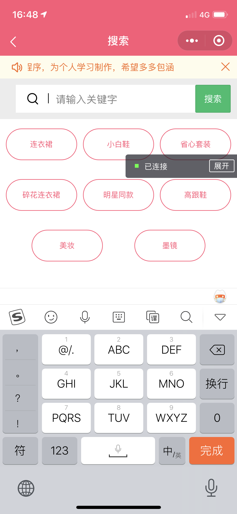
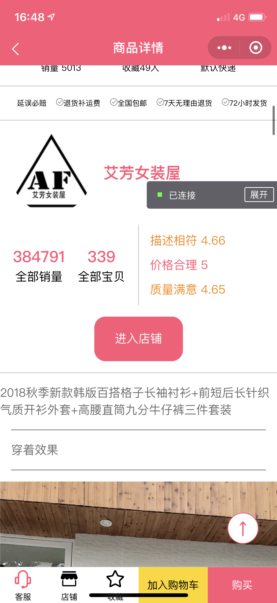
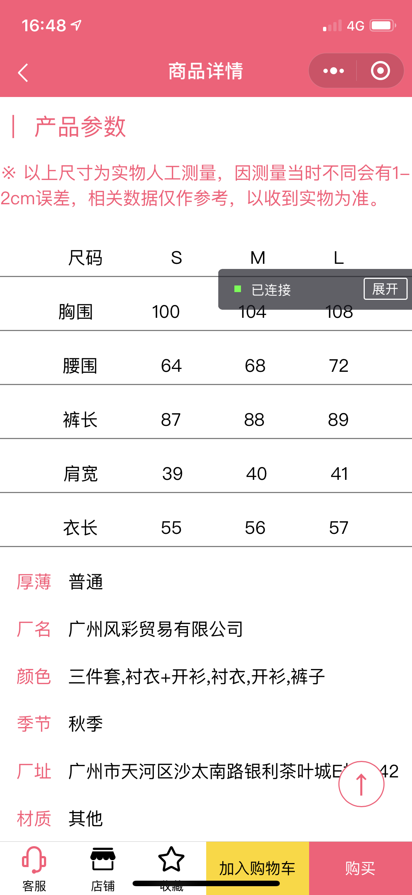
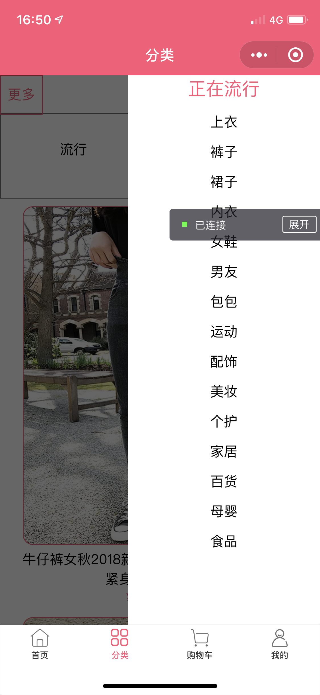
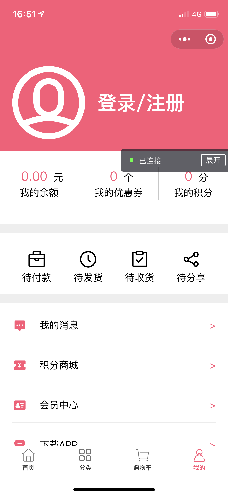
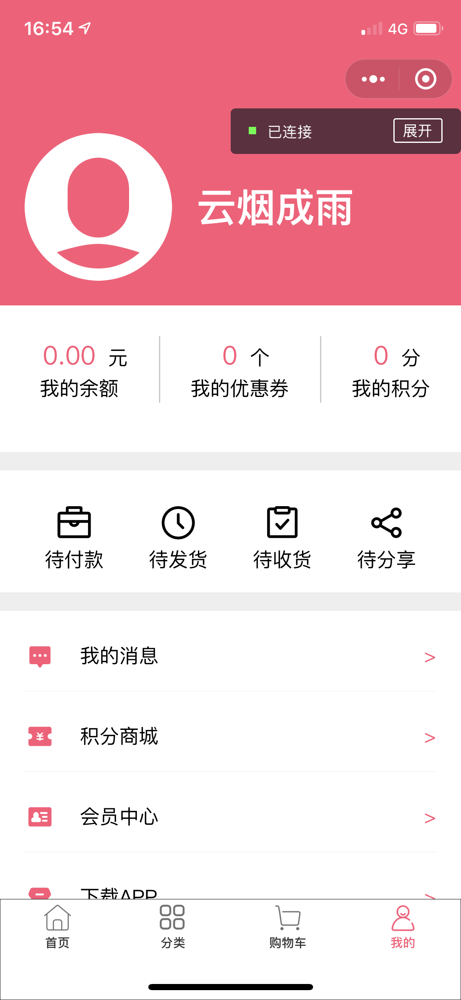

# 我的微信小程序

注：此程序为个人学习制作。以下为创建思路

> wx.request 请求数据（封装后的）
>
> wx.switchTab/wx.navigateTo 进行路由跳转
>
> wx.showToast/wx.showModal/wx.showLoading 进行页面交互
>
> wx.setStorageSync/wx.getStorageSync 进行同步初始化用户数据
>
> wx.setStorage/wx.getStorage （local/index.js)
>
> 进行封装后记录用户信息（以购物车商品为主）
>
> 注： 界面为 html5 + css3 + iView Weapp 搭建
>
> （所有图标均为  iView Weapp 提供）
>
> 用户操作，动画，数据处理，均为 微信小程序内置 API + ES6 语法制作

## 一、首页

### 1.1 请求数据

* 在 network 文件夹内(index.js)对 wx.request 进行 Promise 封装
* 在 home.js 内对所有首页所需数据进行请求并返回
* 所有首页数据全部面向 home.js

### 1.2 封装 Component 

* 轮播图组件(commonents/banner)/选择栏(commonents/tab-consrol)
* 由于在多地会使用这类组件，便直接进行封装
* 此外还有商品(goods-list/goods-item)
* 返回顶部(back-top) / 导航栏(nav) / 首页特有导航栏(nav-search)

### 1.3 记录数据

* 由于下面的数据为多种类型变设计出

* ```js
  goods: {
  	"pop": { page: 0, list: [] },
  	"new": { page: 0, list: [] },
  	"sell": { page: 0, list: [] }
  }
  ```

* 注： "pop" -> 流行
  ​         "new" -> 新款
  ​         "sell" -> 精选
  ​          page -> 当前页码
  ​          list -> 存储数据

* 当页面到达底部会根据当前记录的信息请求对应的数据

## 二、商品搜索

- 数据由 home 组件传输过来
- 动态生成选项
- 并未详细制作搜索

### 2.1 使用微信的 iView Weapp

* 上面通告栏(iView  -> NoticeBar )
* 下面搜索按钮(iView  -> Button )
* 所用搜索图标(iView  -> Icon )

## 三、商品详情页

### 3.1 数据

* 用户点击商品、页面跳转、提供对应商品 iid
* 根据 iid 在 network/details 内进行搜索数据

### 3.2 界面

* 轮播图
* 店名+标题
* 价格
* 销量信息
* 店家承诺
* 店铺信息
* 商品实拍图
* 产品参数
* 评论信息
* 热门推荐
* （返回顶部按钮）
* 底部导航

### 3.3 交互

* 轮播图
* 返回顶部(出现/隐藏)/回到顶部
* 点击收藏出现收藏成功提示/图标变为金黄的
* 再次点出现取消收藏提示、图标还原
* 点击加入购物车(显示/隐藏购物车界面)
* 需要判断用户是否登录
* 当购物车被激活
  * 默认第一张被选中
  * 显示被选中的大图、价格、颜色、型号
  * 可以点击按钮修改商品数量(>= 1)
  * 点击下面对应小图显示对应数据
  * 当用户点击取消，隐藏该页面
  * 当用户点击确认
    * 记录商品图片信息
    * 数量、价格、型号、颜色等
    * 返回给父组件(dateils)
  * 父组件加上是否选中当前商品(默认不选择)
  * 该商品的 iid 并记录在本地存储中

## 四、分类

### 4.1 数据

* 来自(network/classify.js)
* 对应不同分类，不同模块请求对应数据

### 4.2 界面

* 导航栏
* 选择栏
* 商品数据
* （返回顶部）
* 更多分类

### 4.3 交互

* 跟多按钮对应 iview -> Drawer 
* 点击商品请求对应数据
* 点击 流行/精选/新款 对应不同数据

## 五、购物车

* 页面初始化加载查看微信本地存储数据
* 如果没有商品
  * 提示无商品（显示）
  * 商品列表 (隐藏)
  * 点击**首页**跳转至首页
  * **所有操作无效**
* 如果有商品
  * 点击前面的小圆点修改对应商品的**选中为真**
  * 再次点击则取消
* 点击删除按钮
  * 检查商品个数是否为0
  * 是：提示商品为 0
  * 否：
    * 弹出提示框，是否删除所需选商品
    * 是：删除对应商品
    * 否：无操作
* 点击全选
  * 检查商品的选中属性**是否全部**为真
  * 是：取消所有选中
  * 否：全部选中为真
* 合计：实时监听界面用户点击商品并计算出总价
* 结算：计算选中商品数量。当被点击时：
  * 查看是否有商品被选中
  * 是：提示购物成功
  * 否：提示没有选择商品

## 六、我的

* 检查用户是否登录
* 是：
  * 显示一种头像
  * 显示对应用户名
  * 无法进行跳转至登录界面(提示已登录)
* 否：
  * 显示另一种头像
  * 显示 登录/注册
  * 点击时可以跳转到登录界面
* 一些常见样式（iView Weapp 为主）

## 七、登录

* 当用户点击 登录/注册 按钮时：
* 检查用户名是否为空
* 检查密码长度是否在 6-18 位之间
* 检查两次密码是否一致
* 全部符合 -> 修改本地存储信息（以用户名、密码、登录为真)
* 不符合 -> 提示对应应该修正的信息
* 点击密码框后面的小眼睛切换是否显示密码

## 八、页面部分截图
















